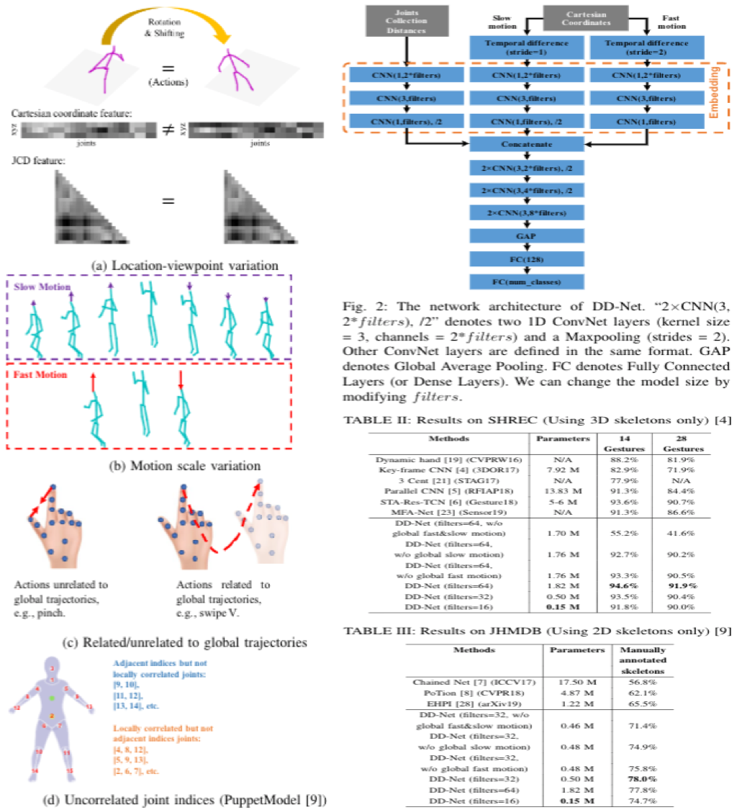

# DD-Net

## About this code
A lightweight network for body/hand action recognition


## How to use this code
### 1. create an anaconda environment by following command
```
conda env create -f=DD-Net_env.yml
```
### 2. go to the folder of JHMDB or SHREC to play with each dataset

## Citation
If you find this code is helpful, thanks for citing our work as,
```
11
```
